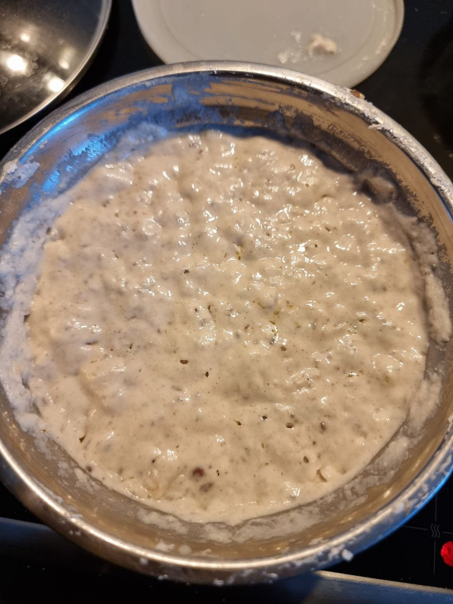
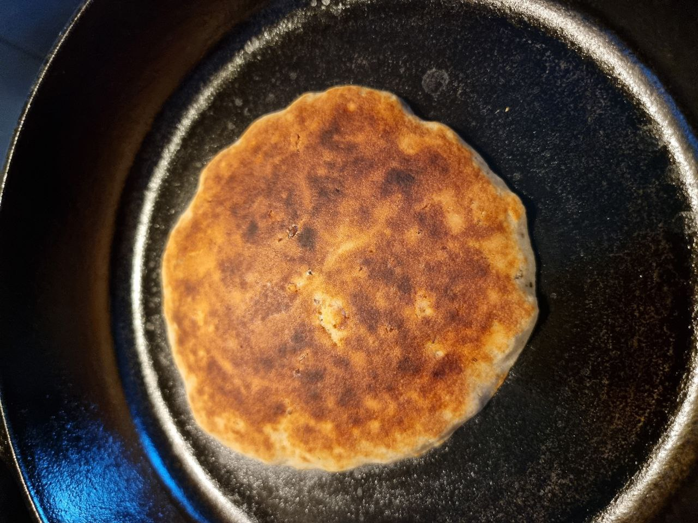
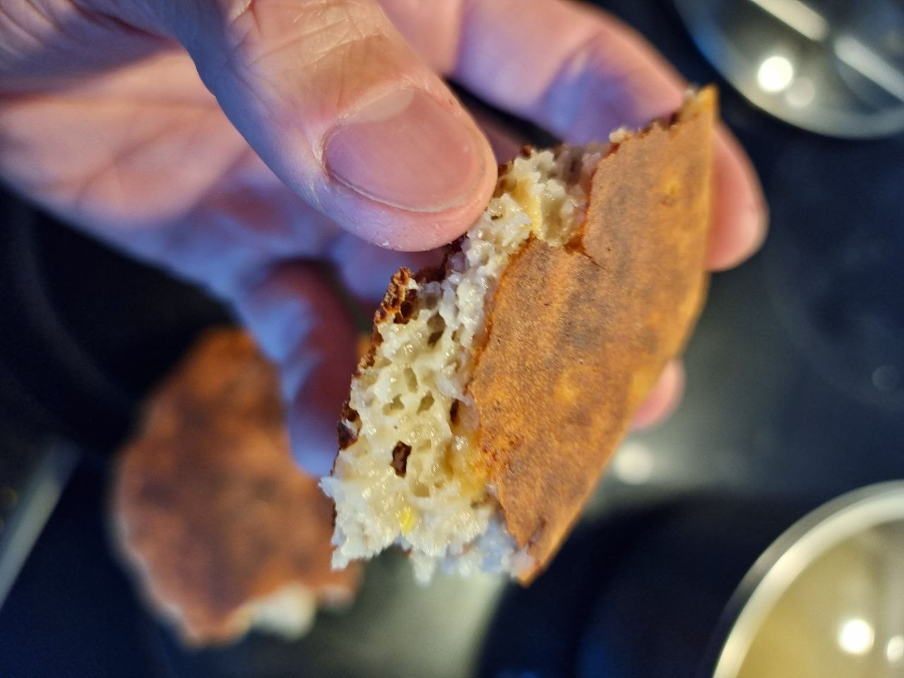

# Rice Corn Buckwheat Flatbread
## Prep
Combine the following in no particular order:
- 40g buckwheat flour
- 100g glutinous rice flour
- 75g white maize flour
- 5g linseed + 5g chia blended
- 1g Guar Gum
- 4g E464 HPMC
- 8g textured pea protein
- 3g salt
- 7g yeast
- 1g baking powder
- 25g brown sugar
- 21g rapeseed oil
- 292g water
- 8g nut Yeast

Keep in fridge at least overnight for best flavor.

## Bake
Put in cast iron skillet and put under broiler in oven on maximum temperature. After browned on one side, flip.
Should be done within 5-10min

## Images

