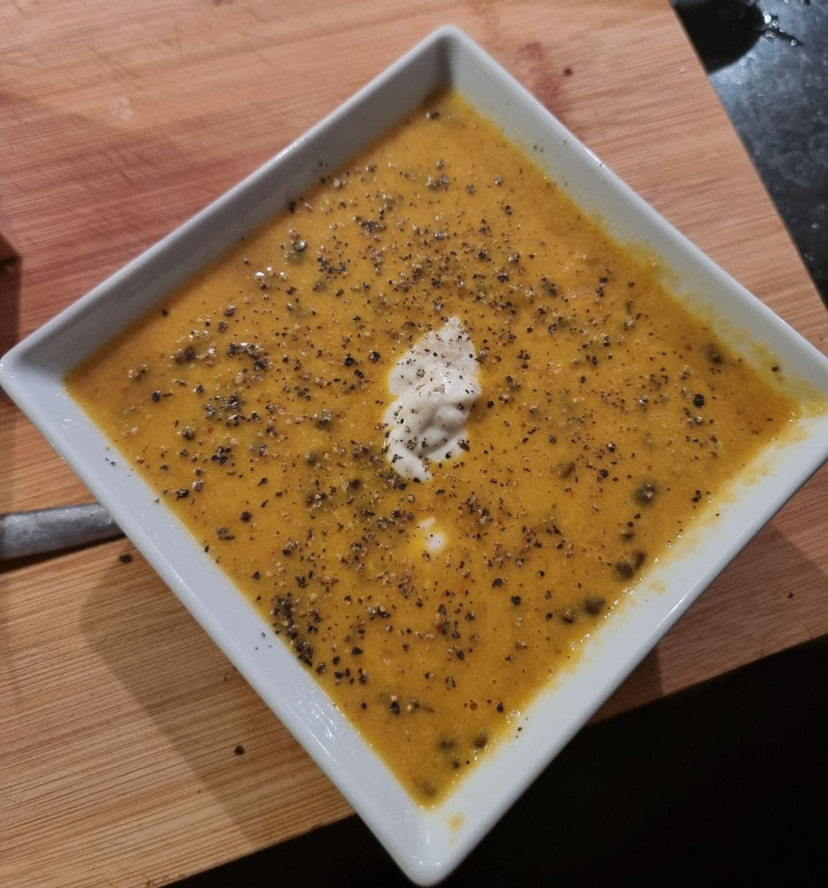

# Carrot Ginger Lentil Soup
## How to
Toast the following with oil
- 5cm Ginger, cut into slices
- a few pickled onions (indian pickle)
- 2 red onions, diced
- 4 cloves garlic, diced
- handful of whole coriander seeds
- Tablespoon of chilli flakes (thai)

Deglaze with
- 1dl white wine

Add 
- 5-6 Carrots, roughly cut
- Black Pepper
- ~5 tablespoons ground coconut
- MSG
- Salt
- Bouillon Cube
- a few strands of saffron
- a squirt of honey
- 4 small potatoes (cooked, or raw)

Let cook for 15-20min to soften carrots
 
Blend with stick blender

Add
- Handful frozen beluga lentils
- a few whole cashews
- Dried ginger
- Turmeric powder
- The juice of half a lime

Let cook for a bit, until carrots are softened

In a separate blender blend with some water:
- 1 apple
- another 1-2cm of ginger

Add the to the soup at the end to preserve the spicyness of ginger

Garnish with fresh black pepper, flaky salt and cashew yogurt

